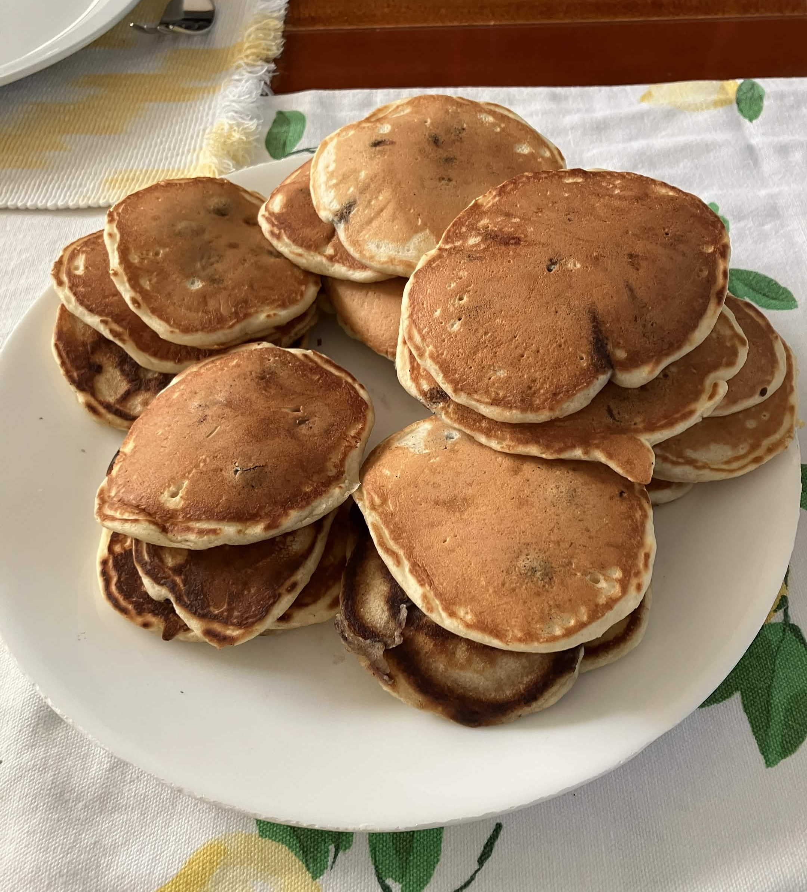
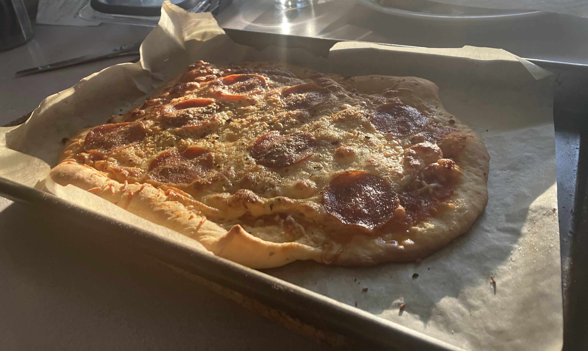
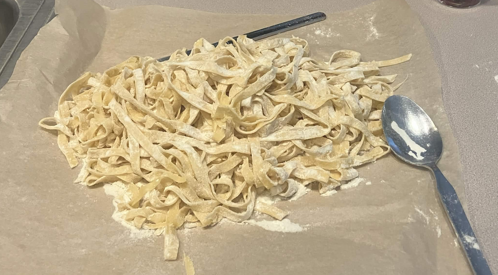
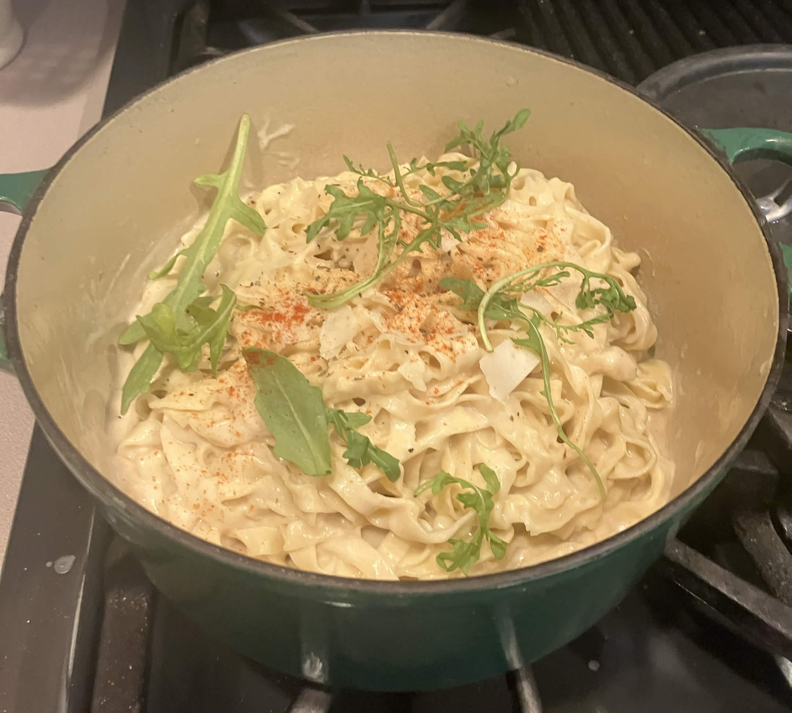
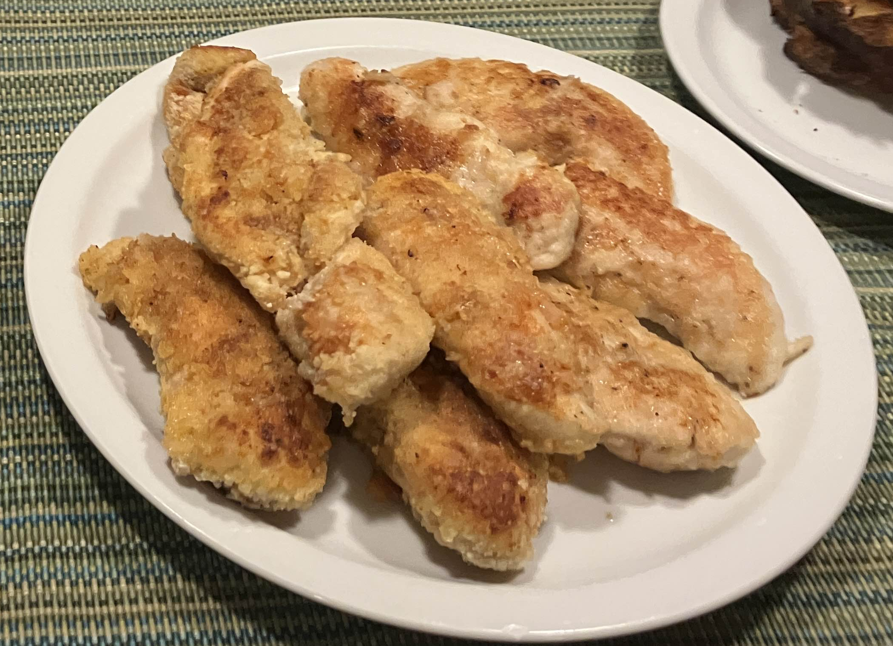
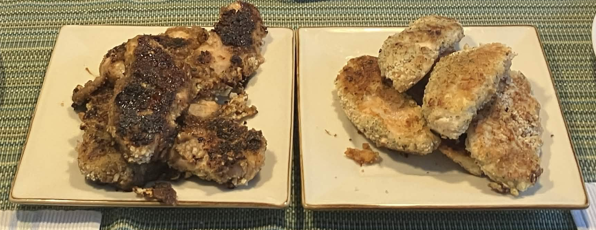

This should be Chapter 2!

Greetings! I cook sometimes. However, my memory's been failing me and I don't trust the random whiteboards/websites/scraps I've been writing these recipes on to stay forever. This is mostly so that all the recipes I use are saved _somewhere_ and I figure it's nice to share.

If I'm ripping someone off, I'll link the recipe. I think all of these recipes have a fair few modifications if they aren't completely original tho.

The first few recipes are for breakfast and the rest are lunch/dinner.

## Pancakes
### Ingredients:
- Flour (1 3/4 Cup)
- Sugar (2 Tablespoons)
- Baking Powder (2 1/2 teaspoons)
- Salt (1/2 teaspoon)
- Egg (1)
- Milk (1 1/2 Cups)
- Butter (3 Tablespoons)
- Optional Chocolate Chips (1 cup)
- Optional Blueberries (1 cup)
### Steps:
1. Mix the flour, sugar, baking powder, and salt in a bowl.
2. In a separate bowl, crack an egg and pour the milk.
3. Melt the butter by microwaving it in a small bowl 8 seconds at a time.
4. While you're waiting for the microwave, you can start washing the measuring cups/spoons and putting the other ingredients away.
5. Pour the butter in the egg/milk mix.
6. Take a whisk and stir the dry mix. 
7. Beat the wet mix until it looks basically even.
8. Pour the dry mix into the wet mix and beat it until it's smooth-ish.
9. If you're prepping this in advance, cover it with cling wrap and put it in the fridge. If not, I guess you can start cooking it.
10. Preheat your pan for a couple of minutes on medium-medium-low. 
11. While you're waiting, you can mix the toppings you chose with the batter.
12. Coat the pan in butter. I don't know why I do this - it doesn't help with sticking. I think it's just superstition?
13. Take a ladle and pour batter into your pan. The amount to pour depends on the size of pancakes you'd like. I think I usually do between 1/3rd and 1/4th of a cup? You can also do multiple pancakes simultaneously.
14. Wait until there are a lot of bubbles on the pancakes to flip them. Or until you can see the edges start to rise/solidify. Note that if you're repeatedly poking/flipping the pancakes, the bubble trick doesn't really work.
15. If you did it right, the cooked side will be golden brown.
16. Repeat until you run out of batter.

## French Toast
### Ingredients: 
- Eggs (1-2)
- Milk (Some? I dunno - maybe 1/2-3/4th cup?)
- Vanilla Extract (Some?? 5 drops? 1/2 teaspoon??)
- Ground Cinnamon (Some. Just have it on hand)
- Slices of bread (4-6. Challah bread or brioche bread are best, but any bread works. Even sandwich bread or sourdough)
### Steps: 
1. Beat your eggs, milk, and vanilla extract in a bowl.
2. If you have one of those like. Wide pyrex containers, you can pour the egg mix in there and that makes frenching the toast easier. If not, a normal bowl is fine. You'll just need to replace the cinnamon more.
3. Preheat your pan at medium-medium-medium-low-low. 
4. Coat the pan in butter.
5. Shake some cinnamon over the bowl/pyrex container.
6. Pick up a slice of bread, dip it in the egg mix. Make sure the first side is completely covered. 
7. Flip it and dip it again. Make sure the second side is completely covered.
8. Put the bread in the pan and flip every couple of minutes. Lowkey I don't know how I tell when it's done. I guess when it stops looking wet and starts looking like french toast?
9. If you're starting to run out of cinnamon in the egg mix, shake more in.
10. Repeat until you run out of egg mix or bread.

## Omelette 
### Ingredients:
- Eggs (3)
- Salt (Some)
- Pepper (Some)
- Shredded cheese (Some - mozzarella's chill, but cheddar/mexican mixes work too)
- Ham (Optional)
- Pepperoni (Optional)
### Steps: 
1. Crack all of the eggs into a bowl.
2. Preheat the pan and coat it in butter.
3. Grind salt/pepper into the egg  mix. I usually do 7-9 grinds of each.
4. Beat the eggs.
5. Pour the egg mixture into the pan.
6. Wait until it's like. 75-85% solidified. While you're waiting, you can wash the bowl and fork/whisk you used to beat the eggs.
7. Cover half of the omelette in cheese and whatever meat/toppings you want. You can kinda do anything here - omelettes are just sandwiches.
8. Wait until the omelette looks pretty much solid, then fold the toppingless half onto the toppingful half.
9. I usually cook each side just a _little_ more to be extra safe. 

## Homemade Pizza
### Ingredients: 
- Flour (1-2 Cups)
- Sugar (1 1/2 tsp)
- Salt (0.75 tsp)
- Garlic Powder (0.75 tsp)
- Paprika (0.75 tsp)
- Instant Yeast (1 Packet)
- Olive Oil (2 1/2 tbsp)
- Warm Water (2/3rds cup)
- Shredded Cheese (Some-Lots)
- Pizza Sauce (Some-Lots)
- Pepperoni (Some)
- Optional Arugula (Some)
### Steps: 
1. Mix 1 cup of flour, salt, sugar, garlic powder, paprika, and instant yeast into a bowl. 
2. Add Olive Oil and Water. Mix. This particular phase isn't that fun to look at, but you won't be looking long.
3. Add up to 1 more cup of flour. Keep mixing until the dough gets more solid/sticky and manages to stay as a single cohesive unit. 
4. Take a larger bowl and brush olive oil over the sides. Take your dough and roll it in the olive oil, then cover the bowl. If you have a lid, great, but if not aluminum foil should work.
5. Preheat your oven to 375-400 degrees farenheit (463.7-477.6 kelvin). My oven's kinda wack, so I need to set it to 455 farenheit (491.7 rankine)
6. Wait 30-45 minutes for it to rise. You can do the oven preheat trick, but you can't use the burners if you're keeping the bowl there. Plastic parts will start melting and it will make you sad.
7. In the meantime, you can clean up the other stuff you used.
8. Split the dough in half.
9. Flour your surface, then sprinkle some flour on the dough. Knead the dough for a while. Toss it in the air. Squish it a bunch. Juggle it. Treat it like your infant son.
10. Place the dough on your surface. Flatten it out with your hands, then roll it out with your rolling pin. The motion I make honestly feels like I'm beating/hammering the dough rather than rolling it out, but it works.
11. Cover an oven tray thing with parchment paper, then transfer your dough there.
12. Repeat for the other dough ball.
13. Take a fork and poke holes all over the dough, then brush some olive oil over the dough.
14. Roll out some sauce over each pizza.
15. Add your cheese/toppings. Add a little more than you think you should.
16. You can also add some salt, pepper, garlic powder, and basil on top of your pizza after adding the toppings.
17. Put it in the oven.
18. Wait 8-12 minutes. At the 8 minute mark, just check on it every 30-45 seconds. When it looks like a finished pizza, then it's probably finished.
19. Take it out and let it cool for 1-2 minutes before serving.

[Here's the recipe I'm ripping off.](https://sugarspunrun.com/the-best-pizza-dough-recipe/)

## Homemade Pasta
### Ingredients: 
- Flour (2 cups)
- Eggs (3)
- Salt (1/2 tsp)
- Olive Oil (1/2 tbsp)
- Pasta Sauce (Whatever you want)
- Water (2/3rds of whatever pot you're using)
### Steps: 
1. Make a big pile of flour and carve a hole in the middle.
2. Put the eggs, salt, and oil in the hole.
3. Knead everything together. Ngl this is kinda texture hell if you're sensitive to that sorta thing. You gotta keep kneading this for maybe 10-15 minutes - pretty much until you get a consistent smooth-ish dough ball. 
4. Wrap the dough in plastic wrap. Let it sit for 30 minutes.
5. You can clean up the mess you made from kneading the dough in the meantime.
6. Split the dough into four pieces.
7. Take one piece and flatten it out with your hands.
8. Run it through the flattener part of your pasta maker at thinness level 1 a couple of times.
9. Fold it over into a rectangle shape.
10. Run it through the flattener part repeatedly, increasing the thinness level gradually as you go. I usually run it through 1 twice, 2 twice, 3, 4, 5, 6, 7, 8, and 9 once. 
11. Take some parchment paper, sprinkle flour on it, and lay your flattened dough out there. If you don't have enough space, sprinkle flour on it and fold it over. Then sprinkle flour on it again. You don't want it sticking to itself.
12. Repeat with the other three dough pieces.
13. It's probably a good idea to start boiling the water now. Pour water into whatever pot you're using until it's 2/3rds done. Add some salt too - however much salt you use for store bought, add maybe 2-3 times as much for this.
14. Pick up a flattened piece of dough and run it through the pasta cutter part of your pasta maker. Repeat with the other three pieces.
15. If the pasta's gonna sit for a long time (as in, you're gonna cook other stuff in the meantime), make sure it doesn't get tangled. Otherwise it can get tangled and sort of melt together. Periodically check on it and detangle the pasta.
16. Once the water's boiling, dump your pasta in.
17. Wait 1 minute.
18. Take it out and put it in a bowl or in the pot with your sauce. 
19. Keep in mind - homemade pasta dries out pretty fast. You're gonna wanna add maybe twice as much sauce or add more pasta water and olive oil after you've taken it out.

[Here's the recipe I'm ripping off.](https://www.loveandlemons.com/homemade-pasta-recipe/)

The Uncooked Noodles

Cooked with Alfredo Sauce and Arugula.

## Fried Rice
This one's very vibes-based. It's mostly a way to get rid of leftover rice and vegetables and anything. It's efficient bowlslop!
### Ingredients:
- Leftover Rice (Maybe 2 cups?)
- Leftover Vegetables (Ideally carrots, peas, lettuce)
- Soy Sauce (Some-Lots)
- Butter (A Little-Some)
- Salt (Some)
- Pepper (Some)
- Garlic Powder (Some)
- Paprika (Some)
### Steps: 
1. Separate each ingredient into a bowl.
2. Maybe sprinkle some water onto the rice.
3. Preheat your cooking pot on medium-low. Coat the bottom in butter.
4. Throw in your "hard" vegetables, like carrots and peas. Stir them around for a minute or two. 
5. Throw in your other vegetables. Stir them around for a minute or two.
6. Add the rice. If it's dry leftover rice, take a wooden spoon and stab repeatedly into the rice to break up the chunks.
7. Pour some soy sauce in. It'll make a nice sizzling sound. 
8. Toss the rice/vegetables.
9. Add some butter and salt/pepper/garlic powder/paprika to taste.
10. Toss the rice/vegetables.
11. Add more soy sauce and other seasoning as you please.
12. Keep tossing until you're satisfied and the rice has browned/yellowed.

## Fried Chicken
### Ingredients: 
- Raw Chicken Tenders (1 pack... it's maybe 1.5-2 lbs?)
- Salt (Some)
- Pepper (Some)
- Garlic Powder (Some)
- Paprika (Some)
- Flour (Some-Lots)
- Egg (1)
- Milk (A little-Some)
- Bread Crumbs (Lots)
### Steps: 
1. Take out your chicken and cutting board.
2. Tenderize your chicken. Ideally, with a tenderizer, but lowkey you can just take a metal fork you aren't particularly attached to and just slam it into the chicken repeatedly. I did this before I learned what a tenderizer's for and the chicken turned out okay.
3. Season each tender with the salt, pepper, garlic powder, and paprika. Rub it in with a fork (or your hands, honestly. That might work better).
4. Flip it over and repeat.
5. Fill a small-medium bowl with flour.
6. Crack an egg into a small-medium bowl and pour some milk in.
7. Beat the egg/milk until it's even looking.
8. Fill a small-medium bowl with bread crumbs.
9. Pick up a tender, roll it in flour. 
10. Dunk the tender in the egg mixture. Shake it a little.
11. Roll the tender in the bread crumbs.
12. Repeat with each tender. You might need to wash your hands ocassionally since the bread crumbs will stick to your hands and it'll feel strange.
13. Preheat your pan on medium-medium-low for 2-3 minutes. 
14. Pour canola oil in the pan and wait 2-3 minutes.
15. Put all the chicken in the pan. Spin/tilt the pan around slightly to make sure the oil gets distributed somewhat evenly.
16. Wait 5 minutes. You can wash the bowls and cutting board in the meantime.
17. Flip each tender. Wait another 4-5 minutes. If you did it right, the bread crumbs should be golden brown.
18. If you like, stick a meat thermometer into each tender. If it's above 160 farenheit (56.9 reamur), you're good to go.

## (Experimental) Korean Fried Chicken
I'm still figuring this one out. I think I've got the taste down, but I don't know how to make it just as crispy without deep frying. I'll update this when I nail it.
### Ingredients: 
- Raw Chicken Tenders (1 pack... it's maybe 1.5-2 lbs?)
- Salt (Some)
- Pepper (Some)
- Garlic Powder (Some)
- Flour (Some-Lots)
- Egg (1)
- Milk (A little-Some)
- Bread Crumbs (Lots. Make sure they're fine or grind them up further)
- Soy Sauce (Some)
- Rice Vinegar (A little-Some)
- Sesame Oil (A little)
- Honey (Some)
- Brown Sugar (Some)
- Ginger (Some)
- Cornstarch (Some)
### Steps: 
1. These first steps will be basically the same as the previous recipe. Take out your chicken and cutting board.
2. Tenderize your chicken. Ideally, with a tenderizer, but lowkey you can just take a metal fork you aren't particularly attached to and just slam it into the chicken repeatedly. I did this before I learned what a tenderizer's for and the chicken turned out okay.
3. Season each tender with the salt, pepper, garlic powder, and paprika. Rub it in with a fork (or your hands, honestly. That might work better).
4. Flip it over and repeat.
5. Now's the part where we make terriyaki sauce. Take a bowl and pour soy sauce, rice vinegar, sesame oil, honey, brown sugar, ginger, garlic powder, and cornstarch in. You will need to add a little more garlic powder, brown sugar, and honey than you expect.
6. This might not be allowed, but you can just taste it as you go. Chances are, it won't be sweet enough and you'll need to add more brown sugar and honey.
7. Once you're happy with the taste, add an egg and beat it.
8. Fill a small-medium bowl with flour.
9. Fill a small-medium bowl with bread crumbs.
10. Pick up a tender, roll it in flour. 
11. Dunk the tender in the terriyaki sauce. Shake it a little.
12. Roll the tender in the bread crumbs.
13. Repeat with each tender. You might need to wash your hands ocassionally since the bread crumbs will stick to your hands and it'll feel strange.
14. Preheat your pan on medium-medium-low for 2-3 minutes. 
15. Pour canola oil in the pan and wait 2-3 minutes.
16. Put all the chicken in the pan. Spin/tilt the pan around slightly to make sure the oil gets distributed somewhat evenly.
17. Wait 5 minutes. You can wash the bowls and cutting board in the meantime.
18. Flip each tender. Wait another 3-4 minutes. If you did it right, the bread crumbs should be golden brown.
19. If you like, stick a meat thermometer into each tender. If it's above 160 farenheit (56.9 reamur), you're good to go.
20. This part's gonna be a bit weird. Take all of the chicken out of the pan and pour the remaining terriyaki sauce in the empty pan.
21. Put the chicken back on the pan for 30 seconds to a minute. 
22. Flip them and wait another 30 seconds to a minute.

On the left is the Korean Fried Chicken and on the right is the Fried Chicken from the previous recipe. This gives away how similar these two recipes are - I literally just replaced the egg mix with terriyaki sauce.

